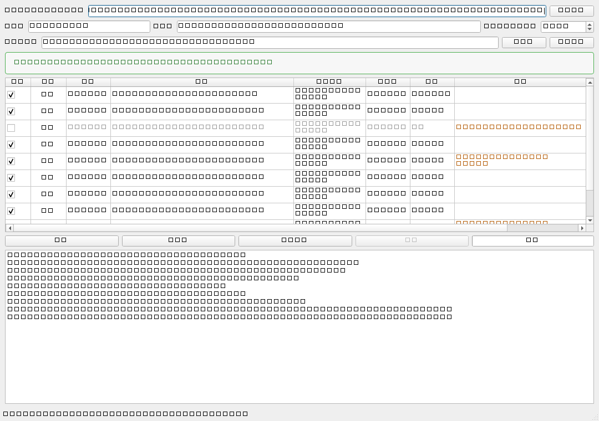

# coolTXTdownload（cool18 小说下载器）

<p align="left">
  <a href="LICENSE"></a>
  
  
  
  <a href="CHANGELOG.md"></a>
</p>

一个带图形界面的网页小说整本下载工具：输入 cool18 论坛小说帖子的**任意一个分卷链接**，
自动找齐散落在多个帖子中的**全部卷**，逐帖校验真实章节区间、自动去重、
核对完整性，最终合并输出为一个干净的 UTF-8 TXT。

> ## ⚠️ 免责声明
> 本项目仅为**个人学习、技术研究和本地备份**用途的爬虫示例，不构成对任何网站的
> 攻击、压测或商业内容分发。使用者应自行遵守目标网站的服务条款、robots 协议及
> 所在地法律法规：**内置请求间隔、失败退避与低频策略**，请勿高频抓取；
> 下载内容的版权归原作者/原发布者所有，**禁止传播、牟利或二次分发**。
> 因使用本项目产生的任何后果由使用者自行承担。

## 界面预览



## 为什么需要它

论坛小说通常一卷一帖、散落在几十个月份里，而且：

- 帖子标题里的卷号**经常是错的**（作者补发、改数、跳号）；
- 同一卷可能被删了重发好几次，出现大量**重复帖**；
- 有的作者全用数字章节，有的用 `四十六章 疑点`、有的按 `（上）（中）（下）`、
  有的整卷只标 `1、2、3、`——**没有任何两本书的目录长一样**；
- 某卷发帖时漏写副标题，**用书名全搜就是搜不到它**。

本工具针对以上每一个坑都有对应处理，见下。

## 特性

- **两种入口**：粘贴任意一卷的帖子链接，或直接输入书名
- **双通道找卷**：站内搜索（自动翻页） + 主帖目录链接，互为补充
- **正文级章节校验**：逐帖读取正文，按真实章节标题核定每卷区间，
  状态列标注 `标题28-32 → 实际28-31` 这类差异
- **章节标题宽松识别**：`第四十六章` / `第46章` / `四十六章 疑点`（不带“第”）/
  `Chapter 46` / `【第四十七章】` / `楔子·序章·番外·后记` / 卷章混排
  （`第八卷 … 第1章` 优先取章）；严格标题不足时自动回退文档级样式
  （`（1）（2）…`、`1、2、…`、行首裸数字，须连续递增才采纳，防误判正文）
- **上/中/下分卷**识别与排序
- **章节完整性核对**：勾选卷的实际区间求并集，与标题声明的最大章号对账，
  红/绿状态条列出疑似缺失章号（如 `⚠ 疑似缺 28、42-45`），随勾选实时更新
- **两级搜索 + 缺口修补**：全名精确搜 → 搜不到或章数缺口大时用书名
  前/后 6 字模糊补搜；校验后发现缺章会**再次自动补搜**，
  章号恰好填补缺口的候选自动勾选并标“请留意”
- **自动去重**：同区间重复帖只留最优；被完全覆盖的卷自动取消勾选；
  部分重叠的卷都保留，下载时按**章节正文哈希**逐章去重，不丢新章不重章
- **人工可干预**：勾选/全选、**拖动行调整下载顺序**（插入指示线 + 源行高亮）、
  每行“打开”按钮跳原帖人工核对
- **单文件 TXT 输出**：卷分隔头 + 文末全部来源 URL 清单
- **设置持久化**：代理、请求间隔、保存目录、上次链接自动记忆
- **命令行模式**：`python crawler.py analyze|download ...`，便于脚本化

## 快速开始

### 方式一：直接运行 exe（Windows）

到 [Releases](../../releases) 下载 `coolTXTdownload.exe`，双击即可，无需安装 Python。

### 方式二：源码运行

```bash
# 1. 克隆仓库
git clone https://github.com/qg19932GH/coolTXTdownload.git
cd coolTXTdownload

# 2. 创建虚拟环境（推荐）
python -m venv .venv
.venv\Scripts\activate        # Windows
# source .venv/bin/activate   # Linux/macOS

# 3. 安装依赖
pip install -r requirements.txt

# 4. 启动图形界面
python app.py            # 或双击 run.bat

# 5.（可选）命令行模式
python crawler.py analyze "https://www.cool18.com/bbs4/index.php?app=forum&act=threadview&tid=14000000"
python crawler.py download "书名关键词" --out ./out
```

### 方式三：自己打包 exe

推 `v*` 标签会自动触发 GitHub Actions 在干净的 Windows 环境打包并把 exe
挂到该标签的 Release（[Actions](../../actions) 页也可手动触发、下载构建产物）。
本地打包命令：

```bash
pip install pyinstaller
pyinstaller --noconfirm --onefile --windowed --name coolTXTdownload ^
    --collect-submodules requests --hidden-import socks --hidden-import bs4 app.py
# 产物在 dist/coolTXTdownload.exe
```

### 代理说明

站点网络环境受限时需在界面里配置代理，支持标准格式，例如：

```
socks5h://127.0.0.1:10808
http://127.0.0.1:10808
```

`socks5h` 表示 DNS 也走代理（推荐）。留空则直连。

## 使用流程

1. 粘贴链接/书名 → 点 **分析书目**。程序依次执行：
   抓取起始帖 → 站内全名搜索（自动翻页）→ 合并主帖目录链接 →
   **逐帖读正文核准章节区间** → 自动去重/排除覆盖 → 完整性核对 →
   （若仍有缺章）模糊补搜。
2. 看顶部**完整性核对**条：
   - 🟢 `✔ 未发现缺漏章` —— 直接下载；
   - 🔴 `⚠ 疑似缺 28、42-45` —— 按缺号到列表里找对应卷，点“打开”核对原帖；
     多半是作者没发或跳号。
3. 按需调整（灰色行 = 程序判定重复/已排除，可手动改；拖动行 = 调整下载顺序）。
4. 点 **开始下载** → `保存目录\书名.txt`，日志区显示进度，完成后不弹窗。

## 工作原理

```
入口(链接/书名)
   ├─ 起始帖解析: 书名、目录链接、标题声明章数
   ├─ 站内搜索: 书名全名 (自动翻页)
   ├─ 模糊补搜: 书名前6字/后6字 (触发式)
   ▼
候选卷列表 ──► 正文校验: 实际章节区间 (标题只作兜底)
   ▼
自动去重: 同区间取最优 / 完全覆盖排除 / 部分重叠保留+提示
   ▼
完整性核对: ∪(勾选卷区间) vs 声明最大章号 ──缺章──► 再次补搜(自动填补)
   ▼
用户确认(勾选/拖动顺序) ──► 下载: 按行序, 章节哈希去重 ──► UTF-8 TXT
```

## 设置

程序目录下 `settings.json`（自动创建，运行期配置，勿提交）：

| 字段 | 说明 |
|---|---|
| `entry` | 上次使用的链接/书名 |
| `proxy` | 代理地址，默认 `socks5h://127.0.0.1:10808` |
| `out_dir` | TXT 保存目录 |
| `interval` | 请求间隔（秒），默认 0.8 |

## 项目结构

```
coolTXTdownload/
├── app.py              # PySide6 图形界面（含可拖动排序表格、完整性核对栏）
├── crawler.py          # 核心库：抓取/章节识别/区间对账/去重/下载 + CLI
├── run.bat             # Windows 双击启动脚本（源码方式）
├── requirements.txt    # 依赖清单
├── CHANGELOG.md        # 更新日志（Keep a Changelog 规范）
├── LICENSE             # MIT
└── docs/
    └── screenshot.png  # 界面截图
```

无框架魔法：`crawler.py` 可独立作为库或命令行使用，GUI 仅消费其公开接口
（`analyze()` / `download_novel()`），便于替换 UI 或接入脚本。

## 开发

```bash
python -m venv .venv && .venv\Scripts\activate
pip install -r requirements.txt

# 无头跑分析（调试识别规则很有用）
python crawler.py analyze <链接>

# GUI 无头冒烟（不弹真窗口）
set QT_QPA_PLATFORM=offscreen && python -c "import app; ..."
```

代码风格：标准库 + 第三方库，无类型强约束，全文件 UTF-8，
GUI 长任务跑在 `QThread`（信号槽刷新），取消用 `threading.Event`。

## FAQ

**Q：搜出来很多重复卷？**
正常——作者删帖重发很常见，程序会按实际章节区间自动去重（状态列标
“重复卷/被覆盖”），保留集已是最小集合。

**Q：说缺第 X 章，但我在论坛能搜到？**
多半是该卷发帖标题与书名有出入（漏副标题、错别字）。新版会在发现缺章后
自动用截短关键字补搜并自动勾选补上；若仍未找到，用每行“打开”按钮人工核对。

**Q：顺序不对？**
按住任意行上下拖动即可，蓝色插入线指示落点，下载严格按当前行序。

**Q：会打满请求吗？**
所有网络操作串行 + 默认 0.8s 间隔 + 失败指数退避；校验/下载均为逐帖低频。

**Q：Linux/macOS 能用吗？**
核心逻辑跨平台，命令行模式可直接跑；GUI 依赖 PySide6 理论可运行，
但仅在 Windows 上开发验证。

## Contributing

Issues 和 Pull Request 欢迎。改章节识别规则时请附带真实帖子样本，
便于回归验证。

## License

[MIT](LICENSE) © 2026 qg19932GH

再次提醒：仅个人学习备份用途，遵守目标网站条款与当地法律，禁止商用与传播。
